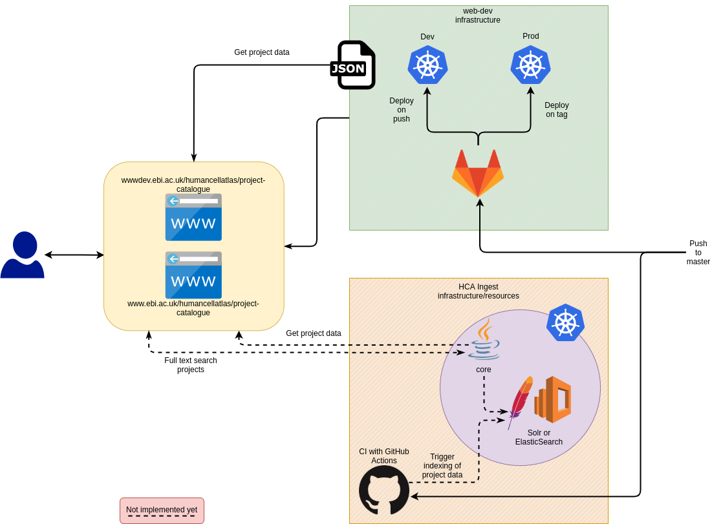

# Projects Index (name TBD)

[Production](https://www.ebi.ac.uk/humancellatlas/project-catalogue)

[Development](https://wwwdev.ebi.ac.uk/humancellatlas/project-catalogue)

## Updating Projects

Data for the UI is in `data/data.json` and is created/updated by running the `scraper.py` script. Please use the `data/published_uuids.txt` to run the scraper. Deleting a project UUID from `published_uuids.txt` will also remove the project from `data.json`.

**You will need Python3 to run the script**

1. Register any projects/publications that you want to add to the catalogue in the prod ingest ui contrinute.data.humancellatlas.org
    1. A script to add from a publication doi exists here: [submit_project_from_doi.py](https://github.com/ebi-ait/hca-ebi-wrangler-central/blob/master/src/submit_project_from_doi.py)
1. Create a new branch of this repository
1. `cd data`
1. Update `published_uuids.txt`, adding ingest project uuids for any projects you would like to add and removing any you would like to remove. Please note:
   1. the scraper script will automatically update any new information from ingest each time it is run 
   1. organs and technologies populate from the `project['organ']` & `project['technology']` field. They either need to be filled in manually on the project form or by running the [`set_project_tech_organs.py`](https://github.com/ebi-ait/hca-ebi-dev-team/tree/master/scripts/set-project-tech-organs) script
1. `./scraper.py`
1. Commit and push the changes in git
1. Create a pull request and merge once unit tests have passed
1. This will be automatically deployed to the [dev environment](https://wwwdev.ebi.ac.uk/humancellatlas/project-catalogue)

_Note: Running `./scraper.py --help` will show other options available. In particular the `--clean` flag may be useful._

## Dev notes

### Tech used

- [Prettier](https://prettier.io/)
  - For code formatting
- Github pages
  - Static hosting
- GitHub actions
  - Continuous Integration/Deployment
- Python
  - For scraping data
- JSON
  - For serving data
- [Riot](https://riot.js.org/)
  - For view components
  - Chosen as very lightweight and has a similiar template syntax to Angular so should be easy to migrate
  - Shares a similiar design princible to React but without JSX/HTML in JS
- [Jest](https://jestjs.io/)
  - For unit tests
- [Parcel](https://parceljs.org/)
  - For building
- [Babel](https://babeljs.io/)
  - JS transpilation
  - Different config for building (with Parcel) and unit tests (with Jest)
- [Yarn](https://yarnpkg.com/)
  - Package manager (instead of npm)

### Overview of infrastructure



### Deployments

All changed in `master` are automatically deployed to the dev environment. In order to deploy to the production environment, follow the below steps:

1. Make sure you have the [`git release`](https://github.com/rdgoite/hca-developer-tools/blob/master/gitconfig) command in your gitconfig.
2. `git checkout master`
3. `git log` -> check latest commit is the commit to be released
4. `git release`

The project catalogue is deployed to the `web-development` k8s cluster and the process is managed in the `ebiwd` namespace in [GitLab](http://gitlab.ebi.ac.uk/). If there are any problems with deployments, you can contact [www-dev@ebi.ac.uk](mailto:www-dev@ebi.ac.uk) and reference ticket `#473703`.

#### Continuous Integration

CI is done in GitLab but only those in the `ebiwd` namespace have access to see progress of the pipeline. So, unit tests are also ran using GitHub actions (see `.github/workflows/ci.yml`) so that any unit test and build errors are caught.

### Gathering published projects data

The current implementation of this project circumvents the need to create a new endpoint in Ingest API by using a Python scraper to gather data for projects. The `/projects/` endpoint in Ingest API is protected but the `projects/search/findByUuid` endpoint is not. The scraper uses a list of Project UUIDs and gathers required data from each project and collates the data into a JSON file that is served by GitHub pages.

A more robust approach would be to create a new `/projects/published` endpoint in Ingest API that is public. This endpoint would serve the same data that the JSON file contains. However, this requires further development and would also need the addition of a UI component to allow wranglers to flag a project as published. For now, this approach has not been done due to time requirements.

Since a new endpoint in Ingest API will eventually be created, the JSON file created by the scraper aims to be as close to the response created by the future endpoint as possible. This will mitigate the need for future changes on the client when a new endpoint is created. On the client, `js/resolver.js` requests data and transforms it to a format that is shown in the UI (i.e. transforms timestamps).

### Developing

- `yarn start`
  - Will spin up the dev server
- `yarn test:watch`
  - Run the unit tests in watch

to run a local instance:

```
npm install
npm run start
```

#### Note about URLs while developing

There is a rewrite rule in nginx config to allow for URLs without the `.html` extension. This is not present with the parcel server and is [not supported](https://github.com/parcel-bundler/parcel/issues/1400). So, links won't work properly in the dev server but you can run `docker-compose up -d --build` to check everything works okay with nginx set up.
