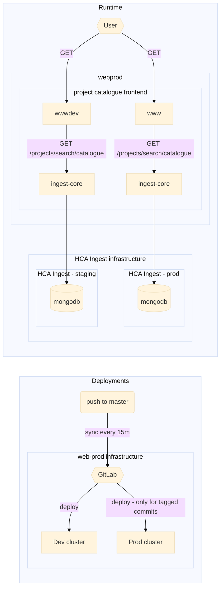

# HCA Project Catalogue

[Production](https://www.ebi.ac.uk/humancellatlas/project-catalogue)

[Development](https://wwwdev.ebi.ac.uk/humancellatlas/project-catalogue)

## Deployments - CI/CD

All changed in `master` are automatically deployed to the dev environment via a gitlab pipeline. In order to deploy to the production environment, follow the below steps:

The project catalogue is deployed to the `web-development` k8s cluster and the process is managed in the [ebi.ac.uk.humancellatlas.project-catalogue project](https://gitlab.ebi.ac.uk/ebiwd/html-sites/ebi.ac.uk.humancellatlas.project-catalogue) in the [`ebiwd` namespace](https://gitlab.ebi.ac.uk/ebiwd) in [GitLab](http://gitlab.ebi.ac.uk/). If there are any problems with deployments, you can contact [www-dev@ebi.ac.uk](mailto:www-dev@ebi.ac.uk) via [Service Now](https://embl.service-now.com/). The sync between github and gitlab is defined in gitlab and maintained by the webprod team.

## Dev notes

### Overview of infrastructure

### Updating of project catalogue in core to include latest projects

At the moment, this is done via [this CRON job](https://github.com/ebi-ait/ingest-kube-deployment/tree/master/cron-jobs/update-project-catalogue). The job will update core with all of the latest information for projects in the catalogue so that they appear in the catalogue.

#### Continuous Integration

CI is done in GitLab but only those in the `ebiwd` namespace have access to see progress of the pipeline. So, unit tests are also ran using GitHub actions (see `.github/workflows/ci.yml`) so that any unit test and build errors are caught.

#### Prettier

Prettier is used for this project for code formatting and is forced through CI. It should run on a pre-commit hook automatically after you `yarn install` but if not you can either set up prettier in your IDE of choice or ust run `yarn prettier . --write` to format your changes.

### Developing

This project uses [Angular CLI](https://github.com/angular/angular-cli) version 13.3.3.

#### Development server

Run `ng serve` for a dev server. Navigate to `http://localhost:4200/humancellatlas/project-catalogue/`. The app will automatically reload if you change any of the source files.

#### Code scaffolding

Run `ng generate component component-name` to generate a new component. You can also use `ng generate directive|pipe|service|class|guard|interface|enum|module`.

#### Build

Run `ng build` to build the project. The build artifacts will be stored in the `dist/` directory. Use the `--prod` flag for a production build.

#### Running unit tests

Run `ng test` to execute the unit tests via [Karma](https://karma-runner.github.io).

#### Running end-to-end tests

Run `ng e2e` to execute the end-to-end tests via [Protractor](http://www.protractortest.org/).

#### Further help

To get more help on the Angular CLI use `ng help` or go check out the [Angular CLI README](https://github.com/angular/angular-cli/blob/master/README.md).

#### Running via Docker

If you make changes to the nginx configuration in `/docker-assets` then it is necessary to verify functionality from the docker container.

`docker-compose up -d --build`

Navigate to http://localhost:8000/humancellatlas/project-catalogue/.
