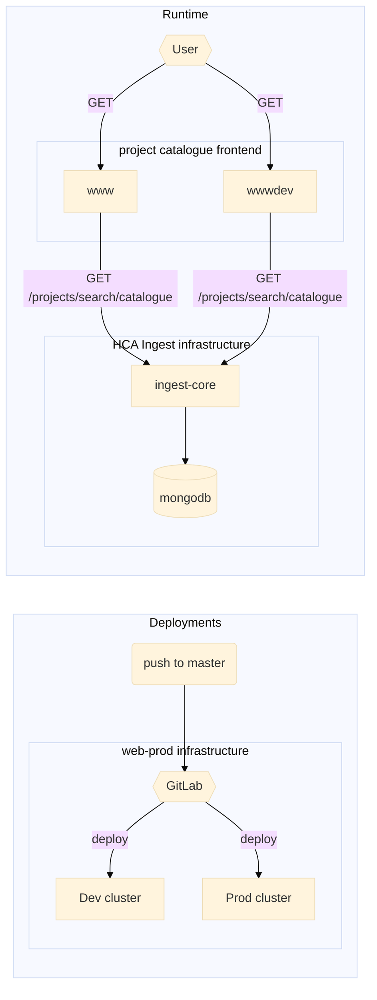

# HCA Project Catalogue

[Production](https://www.ebi.ac.uk/humancellatlas/project-catalogue)

[Development](https://wwwdev.ebi.ac.uk/humancellatlas/project-catalogue)

### Deployments

All changed in `master` are automatically deployed to the dev environment. In order to deploy to the production environment, follow the below steps:

1. Make sure you have the [`git release`](https://github.com/rdgoite/hca-developer-tools/blob/master/gitconfig) command in your gitconfig.
2. `git checkout master`
3. `git log` -> check latest commit is the commit to be released
4. `git release`

The project catalogue is deployed to the `web-development` k8s cluster and the process is managed in the `ebiwd` namespace in [GitLab](http://gitlab.ebi.ac.uk/). If there are any problems with deployments, you can contact [www-dev@ebi.ac.uk](mailto:www-dev@ebi.ac.uk) and reference ticket `#473703`.

## Dev notes

### Overview of infrastructure

#### Continuous Integration

CI is done in GitLab but only those in the `ebiwd` namespace have access to see progress of the pipeline. So, unit tests are also ran using GitHub actions (see `.github/workflows/ci.yml`) so that any unit test and build errors are caught.

### Developing

This project was generated with [Angular CLI](https://github.com/angular/angular-cli) version 9.1.1.

#### Development server

Run `ng serve` for a dev server. Navigate to `http://localhost:4200/humancellatlas/project-catalogue/`. The app will automatically reload if you change any of the source files.

#### Code scaffolding

Run `ng generate component component-name` to generate a new component. You can also use `ng generate directive|pipe|service|class|guard|interface|enum|module`.

#### Build

Run `ng build` to build the project. The build artifacts will be stored in the `dist/` directory. Use the `--prod` flag for a production build.

#### Running unit tests

Run `ng test` to execute the unit tests via [Karma](https://karma-runner.github.io).

#### Running end-to-end tests

Run `ng e2e` to execute the end-to-end tests via [Protractor](http://www.protractortest.org/).

#### Further help

To get more help on the Angular CLI use `ng help` or go check out the [Angular CLI README](https://github.com/angular/angular-cli/blob/master/README.md).

#### Running via Docker

If you make changes to the nginx configuration in `/docker-assets` then it is necessary to verify functionality from the docker container.

`docker-compose up -d --build`

Navigate to http://localhost:8000/humancellatlas/project-catalogue/.
